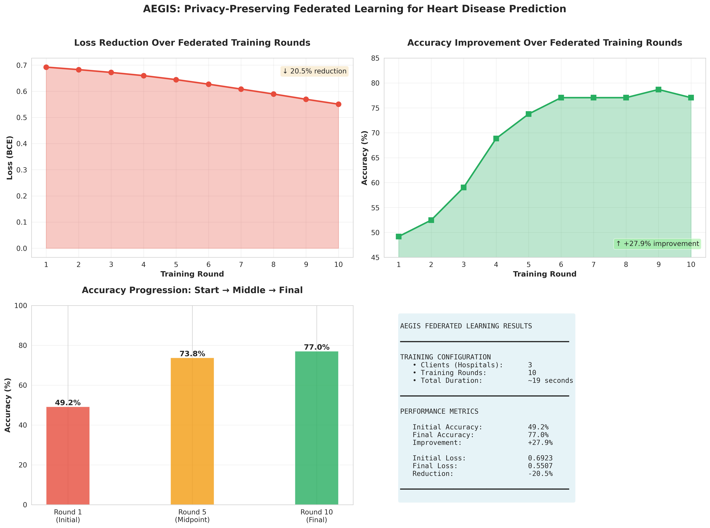

# Aegis
> **Intelligence Shared. Privacy Shielded.**

## Overview

**Aegis** is a privacy-preserving machine learning initiative designed to solve the "data silo" problem in healthcare. Traditional AI requires centralizing data, which creates massive privacy risks and legal bottlenecks. Aegis bypasses this by bringing the model to the data, not the data to the model.

Think of it like this: imagine several hospitals want to collaborate on predicting heart disease, but they can't share patient records due to HIPAA. With Aegis, each hospital trains a model locally on their own data, then shares only the mathematical insights (model updates) with a central coordinator. No patient data ever leaves the hospital.

The result? A model that's learned from everyone's data but has seen no one's actual records.

## Key Features

* **Decentralized Training:** Simulates 4–8 distinct hospital clients with unique patient demographics.
* **Privacy-First Architecture:** Raw data remains strictly on local client devices; only model parameters are transmitted.
* **Federated Averaging:** Implements the `FedAvg` strategy to aggregate insights from diverse sources.
* **Scalable Design:** Built with **Flower (flwr)** and **PyTorch**, designed to be compatible with cloud-native workflows (e.g., AWS SageMaker).

## How It Works

It works on the basis of three steps that repeat over multiple rounds:

1. **Distribution:** A central server sends out the current model to all participating hospitals.
2. **Local Training:** Each hospital trains the model on their private patient data, calculating what needs to change.
3. **Aggregation:** Hospitals send back only their model updates. The server averages these insights to create a smarter global model.

No patient data travels across the network.

## Tech Stack

* **Core Language:** Python 3.x
* **FL Framework:** Flower (`flwr`)
* **ML Backend:** PyTorch / Scikit-learn
* **Data Processing:** Pandas, NumPy
* **Dataset:** UCI Heart Disease (Cleveland)

## Results

Our federated learning approach achieved **77% accuracy** on heart disease prediction 
while maintaining complete data privacy across 3 simulated hospital nodes.

## 🗺️ The Journey Ahead

**Phase 1: Getting Data Ready**
- Load the heart disease dataset
- Split it realistically—Hospital A might see more elderly patients, Hospital B more young athletes

**Phase 2: Building the Network**
- Create the client-side training code each "hospital" runs
- Set up the server that coordinates everything

**Phase 3: Making It Real**
- Run actual training simulations (10-50 rounds)
- Compare results: does our federated model beat what each hospital could do alone?

**Phase 4: Polish & Deploy**
- Visualize how accuracy improves over time
- Document the path to running this on AWS SageMaker for real deployments

## 🤝 Want to Help?

This is early-stage work, and fresh perspectives are incredibly valuable. If you have ideas about differential privacy, model architectures, or just want to poke holes in the approach, I'd love to hear from you.

---

**Note:** Aegis is a demonstration project exploring privacy-preserving ML techniques. It's not medical software and hasn't been validated for clinical use.
